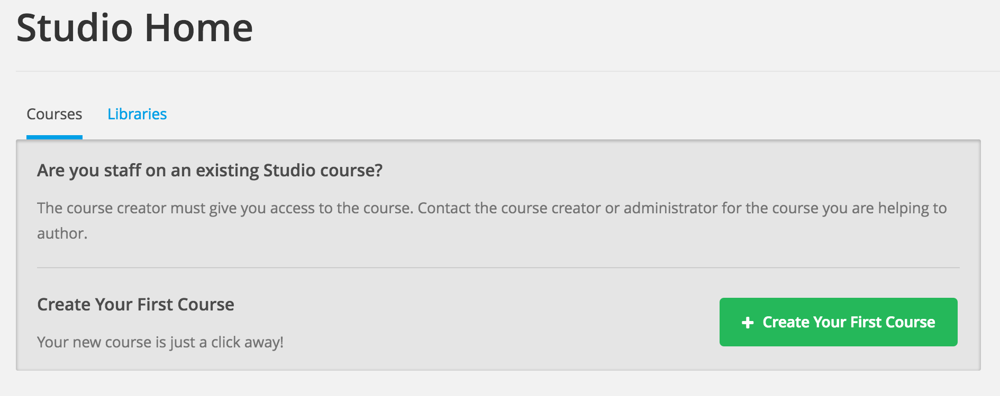
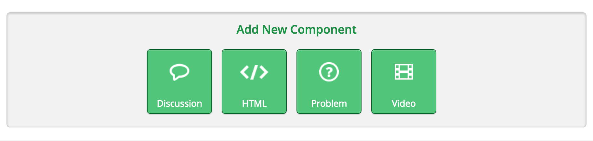
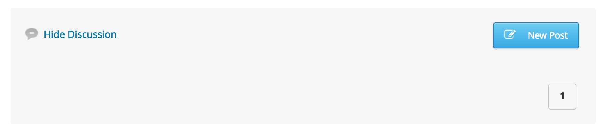
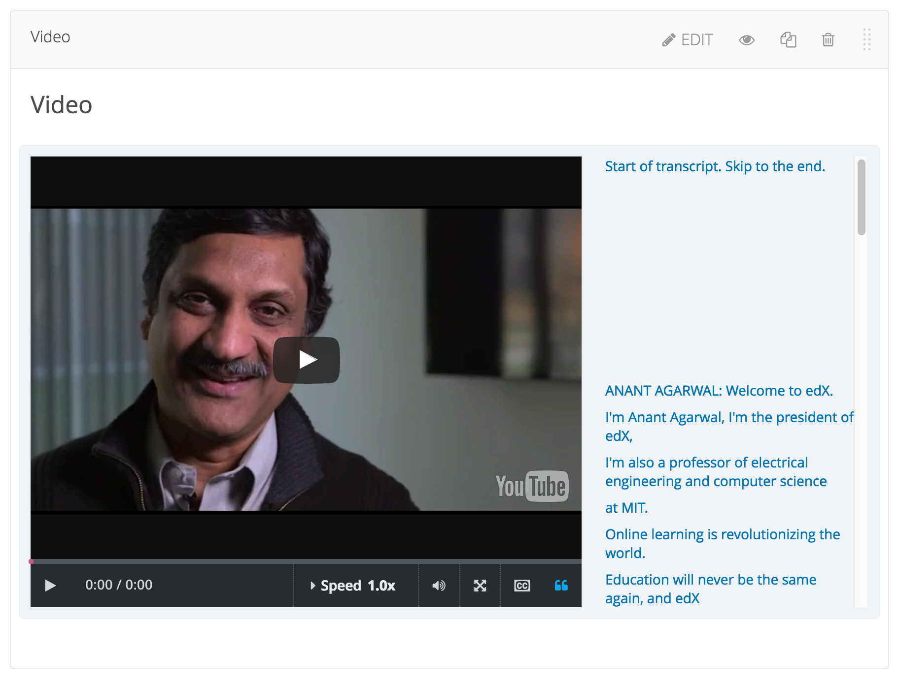
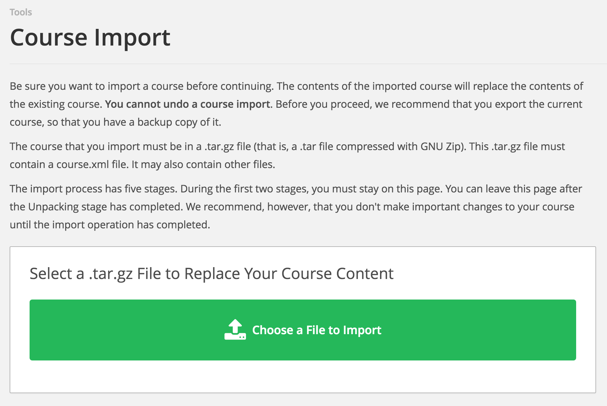
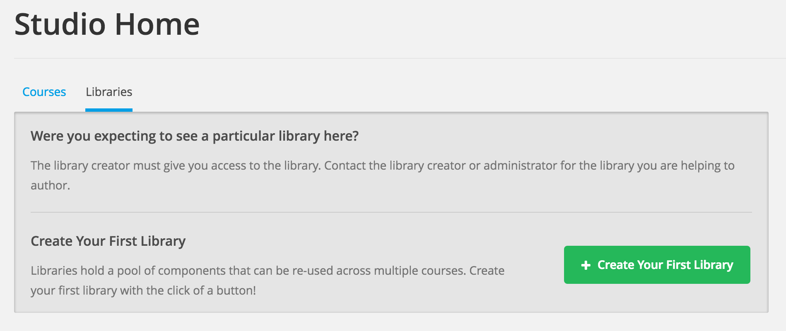
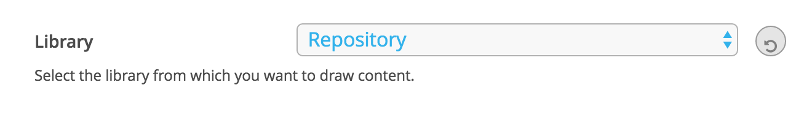
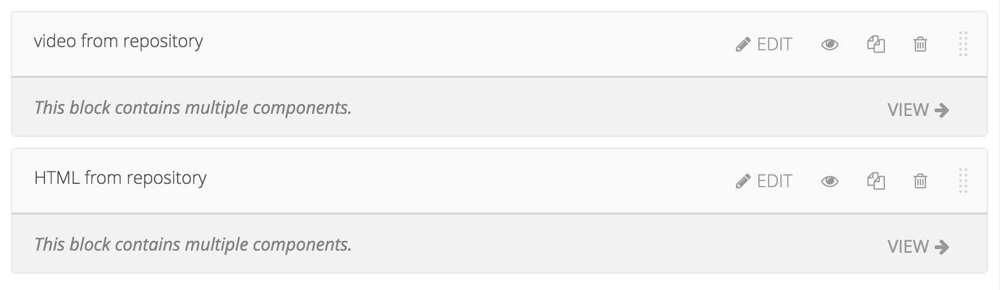
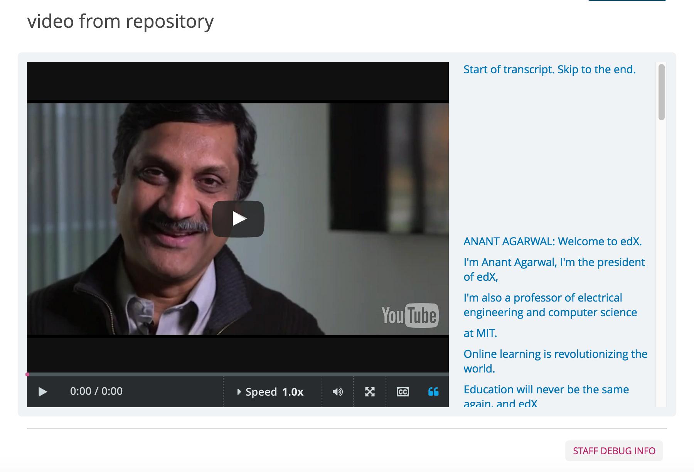
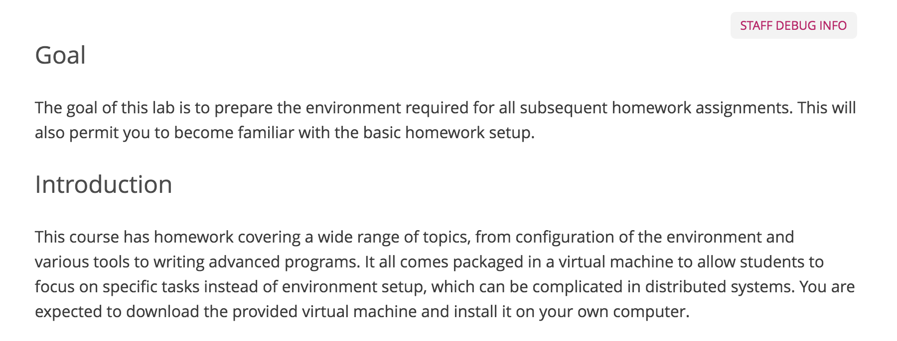

How to Create Online Courses Using edX
===========================================

edX is a massive open online course (MOOC) provider. It hosts online university-level courses in a wide range of disciplines for a worldwide student body, including some courses at no charge. This tutorial will list the steps for creating an online course.

Getting Started with edX
------------------------

In order to use the edX platform, the user should create an account first. As the figure below shows, simply fill in the form and you will receive a registration verification email. Replace "localhost" in the address provided by the email to "cloudmooc2.soic.indiana.edu:18010" (the CMS address of edX) and log into the edX CMS (studio) system.

.. image:: images/edx/register.png
   :height: 300px
   :width: 420px
   :alt: register
   :align: center

Create Your First Course
------------------------

After logging into the system, you should be able to see a blank course list along with a green button titled "Create Your First Course". You can create courses by clicking the button "+ New Course" in the upper right corner. Then fill in the course name, organization, course number and course run in the form.

.. image:: images/edx/create.png
   :height: 320px
   :width: 420px
   :alt: create
   :align: center

After clicking the "Create" button, the website will show the course outline. Of course it will be a blank outline, so you should first create a section using either the "+ New Section" buttons.

.. image:: images/edx/outline.png
   :height: 240px
   :width: 720px
   :alt: outline
   :align: center

A new section now appears. You should be able to edit the name of the section (e.g. week 1), release time, etc. Also, you can create a subsection under this section or a whole new section after this one.

What's more, you may delete this section using the "Trash" button in the upper right corner, or drag this section to another place.

.. image:: images/edx/section.png
   :height: 220px
   :width: 720px
   :alt: section
   :align: center

Create a New Lesson
-------------------

In the subsection created earlier, create a new unit for the lesson. The outline should be as follows:

.. image:: images/edx/unit.png
   :height: 430px
   :width: 720px
   :alt: unit
   :align: center

Click the name of the unit to edit it. You need to import the lessons to present in this unit. There are four types of components that can be used for a presentation:

- Discussion
	In this part, the instructor can create a discussion area for students. Students can post either questions or discussions about this unit (lesson) if necessary. You can give groups of students access to a specific set of course content by clicking the "eye" button.

	The discussion part in LMS is as follows.

- HTML
	edX provides text descriptions here. Choose from several formats to suit your lessons. You should be able to insert hyperlinks and images as well.  If you are already familiar with HTML language, edX encourages you to use "Raw HTML" editing the descriptions directly. Doing so allows you to change features either by using visual editors (like common edit software, e.g. Word) or do raw editing at any time by clicking "Edit" -> "Settings" -> "Editor".

- Problem
	edX also provides several types of problems for the instructors in creating assignments. You can edit the problems in the same way as mentioned above. For each type of problem, the explanation will be presented in detail at the description.

- Video
	Video is the main part of the lesson. By clicking the "video" button, edX will create a video template. You can change the video name URL under the "Edit" window. edX allows each video to show its Closed Captioning transcript on the right side. The transcript should be a .srt file provided by the instructor.

Import/Export Your Course
-------------------------

edX provides an easy way to migrate courses between edX platforms. This function is in "Tools" at the header of the CMS.

- Import
	By clicking "Import", you should be able to see an introduction of the import function and a green "Choose a File to Import" button on the main page. Click the button and select a .tar.gz file which includes the details of the course that you want to import. If this is a new course, you must create a blank course as the base. edX then uses the .tar.gz file to replace the current course, which is blank. If you only need to update, then you can still use the current course.

- Export
	Export is more like a download function. Here you can click "Export Course Content" to download a .tar.gz file including the whole course content. If familiar with HTML language, you should be able to edit the source code as you see fit. Remember to maintain the structure of the course content, otherwise when importing this altered course, the CMS will throw out an error.

.. image:: images/edx/export.png
   :height: 400px
   :width: 720px
   :alt: export
   :align: center

Create Your Library
-------------------

The library in edX is a tool for users who need to reuse course modules which already exist. First ensure that your courses can access the direct library in "Settings", then create a link to the Xblock already stored in the library.

Like in the figure shown above, you need to click on "Libraries" under the "Studio Home", then click "+ Create Your First Library". Next fill in the form just like when creating a new course.

Libraries provide three types of Xblock: HTML, Problem, Video. The descriptions of these three is same as in unit. Make sure the Xblock in the repository has a unique display name, since edX uses this variable to link from the course.

Like courses, libraries have "import" and "export" functions as well. The operations are also the same as in importing/exporting courses.

Use Modules in Libraries
------------------------

You should first make the course accessible to the library from which you want to import course modules. Click on the course, then go to "Settings" and click "Advanced Settings".

.. image:: images/edx/settings.png
   :height: 170px
   :width: 400px
   :alt: settings
   :align: center

Now add "openassessment", "tagging", and "library_content" in the first box as shown below. Next click "Save Changes" at the bottom of the page. You will see a green checkmark informing you that, "Your policy changes have been saved".

.. image:: images/edx/input.png
   :height: 340px
   :width: 700px
   :alt: input
   :align: center

Go back to the unit which you want to import from an existed module. You should be able to see a new component entitled "Advanced". Click it and choose "Randomized Content Block" to create a new Xblock.

.. image:: images/edx/components.png
   :height: 170px
   :width: 700px
   :alt: components
   :align: center

Edit this Xblock in order to link to the existing module in the library. Click "Edit" in the header of the Xblock and input the display name of the Xblock in the library. Choose the library which includes the module in the dropdown box as shown below.

.. image:: images/edx/namebox.png
   :height: 115px
   :width: 620px
   :alt: namebox
   :align: center

After clicking "Save" and assuming you input a correct name, the Xblock should appear as follows:

.. image:: images/edx/link.png
   :height: 120px
   :width: 700px
   :alt: link
   :align: center

You can now click "View" to check the Xblock in the library. After publishing this unit to LMS, LMS will show the Xblock in the library automatically.

Assemble Your Course From Libraries
-----------------------------------

You can use the instructions above to create the structure of a course. After this, in one unit (lesson), you should be able to import course modules from the libraries.

The figure above shows a sample lesson which includes two parts from the library that you chose. The user can click "View" to see the details of the Xblock to which you linked.

Click "Publish" button to publish this lesson to students, allowing them to see it. This sample in LMS (student view) should appear as follows:

