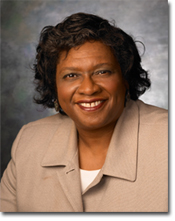

Members
=======

Judy Qiu
--------
.. figure:: images/bio/xqiu.jpg
   :alt: picture judy
   :width: 100

Judy Qiu is an associate professor of Computer Science at Indiana University. Her research encompasses data-intensive computing at the intersection of Cloud and multicore technologies. Judy Qiu leads a new Intel Parallel Computing Center site at IU. She is the recipient of a NSF CAREER Award in 2012 and Indiana University Outstanding Junior Faculty Award in 2015.

Linda Hayden
------------

Linda Hayden is a Professor/ Associate Dean of the School of Mathematics, Science and Technology at Elizabeth City State University, and the Director of the Center of Excellence in Remote Sensing Education and Research (CERSER). She is Principal Investigator on the NSF CyberInfrastructure from Remote Sensing of Ice Sheets project funded through the National Science Foundation Office of CyberInfrastructure CI-TEAM project.

Edward (Clay) Swindell 
----------------------
.. figure:: images/bio/swindell.jpg
   :alt: picture swindell 
   :width: 100

Collections Specialist, Museum of the Albemarle at Elizabeth City State University.

Saliya Ekanayake
----------------
.. figure:: images/bio/esaliya.jpg
   :alt: picture saliya
   :width: 100

Saliya Ekanayake is a Ph.D. candidate in Computer Science at Indiana University,
Bloomington. Saliya's research interests include High Performance Computing,
Data Analytics, Machine Learning, and Distributed Systems. He received his Masters
of Science from the Computer Science Department at Indiana University, Bloomington
in 2011 and Bachelors of Computer Science and Engineering from University of Moratuwa,
Sri Lanka - the top ranking Engineering school in Sri Lanka IN 2008. He's also a
committer in Apache Software Foundation.

Andrew J. Younge
----------------
.. figure:: images/bio/ajyounge.jpg
   :alt: picture andrew
   :width: 100

Andrew Younge is a Ph.D Candidate in Computer Science and a Persistent
Systems Fellow at Indiana University. Andrew’s research interests
include Cloud Computing, Distributed Systems, and High Performance
Computing. He has worked as a member of the FutureGrid project, an
NSF-funded experimental Cloud test-bed for scientific researchers, and
was a visiting researcher at the University of Southern California's
Information Sciences Institute in Arlington, VA. He received his
Bachelors and Masters of Science from the Computer Science Department
at Rochester Institute of Technology (RIT) in 2008 and 2010,
respectively. During this time, Andrew worked as a Graduate Researcher
on the Cyberaide Project in the Service Oriented Cyberinfrastructure
Laboratory and as a Research Assistant on an experimental Social
Psychology research project. Andrew also completed an internship at
the University of Maryland, College Park, where he contributed to the
Lattice Project, a regional Grid computing system.

