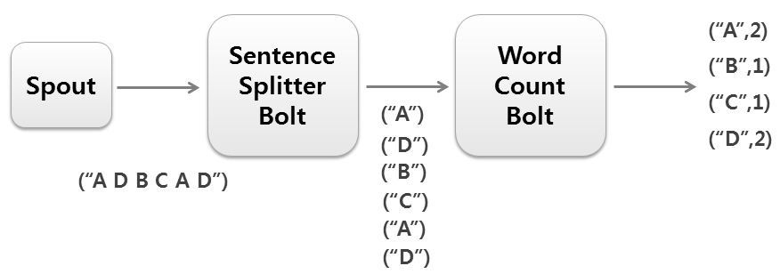

Apache Storm Word Count
=======================

Apache Storm is a distributed stream processing engine.

These are the things we will look at in this Tutorial.

* Word Count program
* Download Apache Storm and set it up on your machine
* Run Word Count

Word Count example
------------------

Word count is a simple streaming example where storm keeps track of the words and their counts streaming in. This example
is included in the Storm distribution. The source code of the example can be found in

examples/storm-starter/src/jvm/storm/starter/WordCountTopology.java

In this example there are three processing units arranged in the graph.

RandomSentenceSpout generates random sentnces. SplitSentence splits these sentences into words. These words are sent to
WordCount bolt where the count is kept.

Here is the source code of the WordCount.

------------------
RandSentenceSpout
------------------

First it generates a random sentence and emit it to the Splitter.

.. code-block:: java

    public class RandomSentenceSpout extends BaseRichSpout {
      SpoutOutputCollector _collector;
      Random _rand;

      @Override
      public void open(Map conf, TopologyContext context, SpoutOutputCollector collector) {
        _collector = collector;
        _rand = new Random();
      }

      @Override
      public void nextTuple() {
        Utils.sleep(100);
        String[] sentences = new String[]{ "the cow jumped over the moon", "an apple a day keeps the doctor away",
            "four score and seven years ago", "snow white and the seven dwarfs", "i am at two with nature" };
        String sentence = sentences[_rand.nextInt(sentences.length)];
        _collector.emit(new Values(sentence));
      }

      @Override
      public void ack(Object id) {
      }

      @Override
      public void fail(Object id) {
      }

      @Override
      public void declareOutputFields(OutputFieldsDeclarer declarer) {
        declarer.declare(new Fields("word"));
      }

    }

------------------
SplitSentence Bolt
------------------

Receives sentences and splits them in to words. Words are emitted to the WordCount bolt.

.. code-block:: java

    public static class SplitSentence extends ShellBolt implements IRichBolt {
        public SplitSentence() {
          super("python", "splitsentence.py");
        }

        @Override
        public void declareOutputFields(OutputFieldsDeclarer declarer) {
          declarer.declare(new Fields("word"));
        }

        @Override
        public Map<String, Object> getComponentConfiguration() {
          return null;
        }
    }

The above class uses a python file to split the sentences.

.. code-block:: java

    import storm

    class SplitSentenceBolt(storm.BasicBolt):
        def process(self, tup):
            words = tup.values[0].split(" ")
            for word in words:
              storm.emit([word])

    SplitSentenceBolt().run()

It will be a good exercise to change the source code to pure Java.

--------------
WordCount Bolt
--------------

.. code-block:: java

    public static class WordCount extends BaseBasicBolt {
        Map<String, Integer> counts = new HashMap<String, Integer>();

        @Override
        public void execute(Tuple tuple, BasicOutputCollector collector) {
          String word = tuple.getString(0);
          Integer count = counts.get(word);
          if (count == null)
            count = 0;
          count++;
          counts.put(word, count);
          collector.emit(new Values(word, count));
        }

        @Override
        public void declareOutputFields(OutputFieldsDeclarer declarer) {
          declarer.declare(new Fields("word", "count"));
        }
    }

---------------------
Building the Topology
---------------------

This code arranges the components described earlier in to a graph.

.. code-block:: java

    public static void main(String[] args) throws Exception {
        TopologyBuilder builder = new TopologyBuilder();
        builder.setSpout("spout", new RandomSentenceSpout(), 5);
        builder.setBolt("split", new SplitSentence(), 8).shuffleGrouping("spout");
        builder.setBolt("count", new WordCount(), 12).fieldsGrouping("split", new Fields("word"));

        Config conf = new Config();
        conf.setDebug(true);

        if (args != null && args.length > 0) {
          conf.setNumWorkers(3);

          StormSubmitter.submitTopologyWithProgressBar(args[0], conf, builder.createTopology());
        } else {
          conf.setMaxTaskParallelism(3);
          LocalCluster cluster = new LocalCluster();
          cluster.submitTopology("word-count", conf, builder.createTopology());
          Thread.sleep(10000);
          cluster.shutdown();
        }
    }

Storm Setup
-----------

Now lets look at how to setup a Storm Cluster in your local machine. A storm cluster needs Apache ZooKeeper running

.. code-block:: bash

    wget http://mirrors.ibiblio.org/apache/storm/apache-storm-0.10.1/apache-storm-0.10.1.tar.gz
    tar -xvf apache-storm-0.10.1.tar.gz

----------------------------
Download and start ZooKeeper
----------------------------

.. code-block:: bash

    wget http://apache.mirrors.pair.com/zookeeper/zookeeper-3.4.8/zookeeper-3.4.8.tar.gz
    tar -xvf zookeeper-3.4.8.tar.gz
    cd zookeeper-3.4.8
    cp conf/zoo_sample.cfg conf/zoo.cfg
    ./bin/zkServer.sh start

------------------------------------
Start Storm Cluster on Local machine
------------------------------------

.. code-block:: bash

    cd ../apache-storm-0.10.1

In one terminal start the nimbus server

.. code-block:: bash

    ./bin/storm nimbus

In another terminal start the supervisor

.. code-block:: bash

    ./bin/storm supervisor

In the 3rd terminal start the Storm Web UI

.. code-block:: bash

    ./bin/storm ui

Above command will start the Storm UI. You can visit

http://localhost:8080/index.html

to view the storm cluster.

--------------------------
Run the example word count
--------------------------

Now open another termial to run a Storm example word count

.. code-block:: bash

    ./bin/storm jar examples/storm-starter/storm-starter-topologies-0.10.1.jar storm.starter.WordCountTopology WordCount

You can view the topology by going to the web browser.

http://localhost:8080/index.html

To kill the topology use the command

.. code-block:: bash

    ./bin/storm kill WordCount

